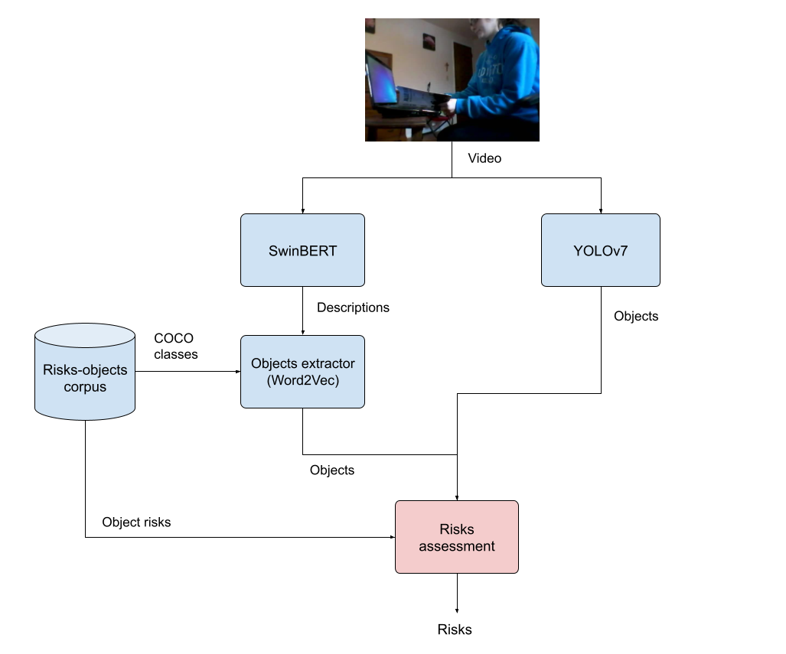

# Indoor Risks Assessment using Video Captioning

This repository contains all the execution resources and evaluation code used in the bachelor's thesis Indoor Risks Assessment using Video Captioning.

This thesis proposes a framework for assessing risks in indoor scene videos using Video Captioning and Object Recognition models. Additionally, it presents various deep learning-based architectures for analyzing indoor scene videos, with applications in fields such as robotics, surveillance systems, and Ambient Assisted Living for individuals with special needs, including the elderly and visually impaired. 

The architecture will be mainly composed by the Video Captioning model SwinBERT, which will descriptions will be enhanced using linguistic processing techniques, and by YOLOv7, which will improve the detection rate of objects.

## Setup environment

A shell script is provided to launch a [docker container](https://hub.docker.com/r/javiro01/risks-assessment) on which the Risks Assessment can be tested over input videos. Also the [repository](https://github.com/javirodrigueez/swinbert-evaluation) of the paper *Indoor Scenes Video Captioning* can be accessed to get further information about the evaluation of SwinBERT descriptions. Use ``get_risks.sh`` to execute the Risks Assessment test.

## Author

jrodriguez@dtic.ua.es